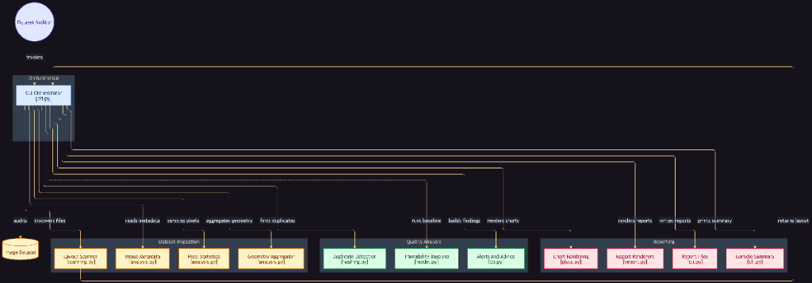

# 🔍 Tathya — uncover the truth of your dataset before you train

[](#)
[](https://www.python.org/downloads/)
[](https://github.com/astral-sh/ruff)

A small, dependency-light Python tool that takes *any* image dataset and automatically
investigates it, then generates a self-contained **HTML report** (charts
embedded, no internet needed), a **Markdown report** and a machine-readable
**JSON report** — plus a console summary of everything it found.

No PyTorch, no TensorFlow, no GPU, no heavy dependencies. Just standard
scientific Python (`Pillow`, `numpy`, `matplotlib`) with **scikit-learn**
used optionally for a quick trainability baseline.

---

## Quick start

### Installation

Install locally with pip:

```bash
# Clone the repository
git clone https://github.com/your-username/tathya.git
cd tathya

# Install in editable mode
pip install -e .

# Or with optional baseline modeling and dev dependencies:
pip install -e ".[baseline,dev]"
```

### Usage

```bash
# Using the installed CLI command:
tathya C:/path/to/your/dataset

# Or via script / python module:
python tathya.py C:/path/to/your/dataset
python -m tathya C:/path/to/your/dataset
```

The report lands in `<dataset>/tathya_report/` by default:
`report.html`, `report.md`, `report.json` (+ `assets/*.png` charts).

Want to try it immediately? Generate a synthetic demo dataset first:

```bash
python make_sample_dataset.py
tathya sample_data/fruits_veggies
tathya sample_data/split_dataset
tathya sample_data/flat_mixed
```

## What it detects automatically

| Area | Checks |
|---|---|
| **Structure** | Folder-per-class, train/val/test splits, flat/unlabelled, or `labels.csv` sidecar files |
| **Class balance** | Per-class counts, imbalance ratio (max/min), Gini coefficient, tiny classes |
| **Health** | Corrupt/unreadable files, file formats, colour modes, EXIF orientation, multi-frame images |
| **Geometry** | Min/median/max sizes, percentiles, aspect ratios + a recommended resize size |
| **Pixels** | Mean brightness/contrast, Hasler-Süsstrunk colorfulness, RGB channel correlation, over/under-exposure and low-contrast ratios (sampled on thumbnails) |
| **Duplicates** | Exact duplicates (sha256) **and** perceptual near-duplicates (64-bit dHash, no extra dependency) with potential disk savings |
| **Leakage** | Near/exact duplicate groups that span train ↔ test / val — optimistic validation warning |
| **Trainability** | Optional `PCA + logistic regression` 3-fold CV baseline (sklearn) |
| **Alerts** | Severity-tagged findings + a concrete recommendations checklist |

## Command-line options

```
usage: tathya ROOT [options]

  ROOT                path to the dataset folder

  -o, --output DIR     report output folder (default: <root>/tathya_report)
  --formats html md json   report formats to write (default: all three)
  --workers N          parallel worker threads (default: half the CPUs)
  --pixel-sample N     max images used for pixel statistics (default 4000)
  --no-pixel-stats     skip the pixel-statistics pass
  --no-dedup           skip exact + near-duplicate detection
  --dup-threshold T    dHash Hamming distance for near-dups (default 6)
  --near-dup-cap N     images considered for near-dup detection (default 20000;
                       larger datasets are deterministically sampled)
  --no-baseline        skip the trainability baseline
  --no-plots           skip chart rendering
  --silent             quieter console output
  --open               open report.html in the browser when done
```

For very large datasets all the heavy passes (metadata, hashing, pixel stats)
are parallelised with a thread pool and are **resumable-friendly**: geometry
always covers every image, while pixel statistics use a deterministic,
class-aware sample.

## How layout detection works

1. Every image file under `ROOT` is discovered (`.jpg .jpeg .png .bmp .gif
   .webp .tif .tiff ...`; hidden folders and `node_modules`-style noise are
   skipped).
2. The folder shape decides the layout:
   - `class/…` → **classification folders** (labels from folder names)
   - `train|val|test/class/…` → **split dataset** (a class-coverage table,
     missing-class warnings and train→test leakage checks are added)
   - plain images at the root → **flat/unlabelled** (unless a `labels.csv` /
     `metadata.csv` / ... file maps images to classes, in which case it is used)
   - nested/mixed depths → **irregular**, deepest meaningful folder name is the label

## Interpreting the reports

- **Alerts** are listed first: corrupt files, duplicates, imbalance, extreme
  exposures/contrast, missing classes in a split, leakage …
- The **baseline CV accuracy** is a coarse "is there learnable signal?" probe
  (32×32 grayscale → PCA(64) → logistic regression, 3-fold). It is *not* a
  substitute for real model training.
- Near-duplicate groups are approximate (perceptual hash) — always eyeball
  them before deleting anything. The JSON report contains the full lists.

## Architecture



Tathya processes image datasets across three core functional subsystems orchestrated by `cli.py`:

1. **Dataset Inspection**:
   - **Layout Scanner** (`scanning.py`): Automatically discovers files, filters noise directories, and identifies dataset structure (folder-per-class, splits, flat with CSV).
   - **Image Metadata** (`analysis.py`): Reads image dimensions, color modes, and EXIF orientations across parallel worker threads.
   - **Pixel Statistics** (`analysis.py`): Computes channel means/stds, Hasler-Süsstrunk colorfulness, and exposure metrics on downscaled thumbnails.
   - **Geometry Aggregator** (`analysis.py`): Analyzes aspect ratio distributions and calculates optimal recommended resize targets.

2. **Quality Analysis**:
   - **Duplicate Detector** (`hashing.py`): Flags exact SHA-256 byte duplicates and clusters perceptual near-duplicates via 64-bit dHash. Detects train/val/test data leakage.
   - **Trainability Baseline** (`model.py`): Sanity-checks dataset separability using a lightweight PCA + Logistic Regression 3-fold CV.
   - **Alerts and Advice** (`cli.py`): Aggregates findings and generates prioritized severity-tagged recommendations.

3. **Reporting**:
   - **Chart Rendering** (`plots.py`): Builds distribution, class balance, and aspect ratio visualizations encoded directly into base64 images.
   - **Report Renderers** (`report.py`): Produces an interactive, offline HTML report dashboard and an easy-to-read Markdown summary.
   - **Report Files & Console Summary** (`cli.py`): Exports `report.html`, `report.md`, `report.json`, and outputs the CLI summary directly in terminal.

## Project layout

```
tathya.py                   CLI entry point
tathya/
  scanning.py               file discovery + layout detection
  hashing.py                sha256 exact-dups + dHash near-dups
  analysis.py               per-image metadata & pixel statistics
  model.py                  optional sklearn trainability baseline
  plots.py                  matplotlib charts → base64 data URIs
  report.py                 HTML & Markdown renderers
  cli.py                    orchestration + console summary
docs/
  architecture.png          system architecture diagram
make_sample_dataset.py      synthetic demo datasets (fruits_veggies,
                            split_dataset, flat_mixed)
```

## Limitations

- `HEIC/HEIF/AVIF` require a Pillow build with the matching plugin; otherwise
  they are flagged as undecodable and a conversion recommendation is made.
- dHash near-duplicate detection is rotation/scale-crop *not* robust — it
  targets resized / re-encoded / brightness-shifted copies.
- Pixel statistics come from down-scaled thumbnails (≤ 192 px) to keep huge
  datasets fast.

## Testing & Development

Run the test suite using `pytest`:

```bash
pytest -v
```

Lint with `ruff`:

```bash
ruff check .
```

## Contributing

Contributions and feedback are welcome! Please see [CONTRIBUTING.md](CONTRIBUTING.md) for setup details and guidelines.
